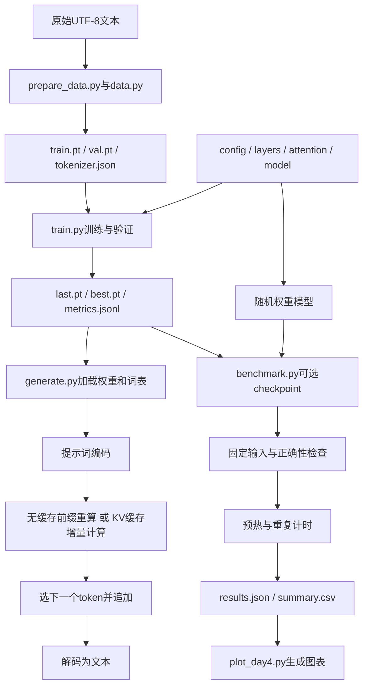

# KVForge：Day 1～Day 4 项目流程复习

项目有三条路径：训练让权重学习；生成使用已有权重续写；benchmark测计算开销。
生成和benchmark不更新参数，benchmark也不要求先训练一个好模型。

## 1. 总览



## 2. 文件职责

| 文件 | 作用 | 输入→输出 |
|---|---|---|
| kvforge/config.py | 校验模型尺寸和后端 | 参数→ModelConfig |
| kvforge/layers.py | RMSNorm、RoPE、SwiGLU | 隐藏向量→变换后向量 |
| kvforge/attention.py | QKV投影、因果注意力、缓存接入 | 新隐藏状态+可选缓存→新位置输出 |
| kvforge/model.py | 组装Block与语言模型 | token ID→logits及可选loss |
| kvforge/data.py | 字符词表、数据文件、抽样窗口 | 文本/整数序列→tokenizer或x/y |
| prepare_data.py | 数据准备入口 | 文本路径→数据目录 |
| kvforge/training.py | 学习率、验证、保存 | 当前状态→学习率/验证loss/checkpoint |
| train.py | 组织训练与恢复 | 数据/参数/可选checkpoint→权重和日志 |
| kvforge/cache.py | 管理每层紧凑KV | 新K/V→有效历史加新K/V |
| generate.py | 自回归生成 | checkpoint与提示词→续写文本 |
| kvforge/benchmarking.py | 正确性、计时与汇总 | 模型与固定ID→指标 |
| benchmark.py | 实验组合与报告 | 参数/可选checkpoint→JSON/CSV |
| plot_day4.py | 离线绘图 | JSON→PNG |
| tests/test_day1～4.py | 23项回归测试 | 小案例与CLI→通过或错误信息 |

## 3. 数据怎样进入训练

1. prepare_data.py解析输入路径，调用prepare。
2. 读取UTF-8文本，先切分训练段和验证段。
3. 仅用训练段的字符去重排序，生成字符词表；ID0表示未知字符。
4. 将两段编码成一维long张量，保存train.pt、val.pt及tokenizer.json。
5. train.py调用load_data，恢复词表，并计算数据文件联合指纹。
6. get_batch随机抽B个窗口，每个窗口取T+1个token，再错开一位构造输入/标签。

例：[a,b,c,d,e] → x=[a,b,c,d]，y=[b,c,d,e]，形状都是[B,T]。
模型内部不再次错位。训练集和验证集不能混用来拟合词表。

## 4. 一次模型前向

```text
token ID [B,T]
  → Embedding [B,T,C]
  → 重复L层：
      x = x + Attention(RMSNorm(x))
      x = x + SwiGLU(RMSNorm(x))
  → 最后RMSNorm
  → lm_head [B,T,V]
  → 若提供targets：交叉熵得到标量loss
```

RMSNorm沿特征维归一化；RoPE用于Q/K；SwiGLU逐位置变换特征；GQA减少KV头。
lm_head.weight与embedding.weight共享同一个Parameter，不是复制数值。
logits是分数不是概率；交叉熵内部处理log_softmax，不先手动softmax。

## 5. 一次训练更新

```text
model.train()
→ 抽取x/y（或overfit固定batch）
→ 根据全局step设置学习率
→ zero_grad清旧梯度
→ forward算loss
→ backward产生梯度
→ 若启用缩放，先unscale
→ 梯度裁剪
→ optimizer step更新参数
→ 更新GradScaler状态
```

当前CPU FP32下scaler禁用，调用相当于普通训练路径。CUDA FP16启用时，非有限梯度可能导致scaler跳过更新。
backward负责产生梯度，step才更新权重。训练warmup提高学习率，benchmark warmup只是先运行不计成绩，两者不同。

## 6. 验证与保存

evaluate临时eval+no_grad，用独立固定种子抽验证窗口，平均loss，结束恢复模式。
这是固定采样估计，不是遍历全验证集。训练loss下降不保证泛化变好；固定batch过拟合仅检查训练链路。

保存内容包括：model、model_config、optimizer、scaler、settings、step、best_val、chars、data_fingerprint、sampler_rng、torch_rng、cuda_rng。
last.pt是最近保存点；best.pt是已观察到的最佳验证loss对应保存点。
metrics.jsonl一行一条训练日志。先写临时文件，再替换正式checkpoint。

恢复训练先检查数据指纹，再加载权重、优化器、scaler、步数与随机状态。
只设置相同种子不能恢复随机流中断的位置；只加载权重也不能恢复AdamW历史。

## 7. 无缓存与缓存生成

generate.py加载model_config、model、chars，重建模型与tokenizer。
提示词编码为[B,T]，生成函数临时eval+no_grad，循环选新token追加到完整ids。
temperature=0取argmax；正温度时缩放分数、top-k筛选、按概率采样；未知ID0不生成。

无缓存：每次完整计算ids最后max_seq_len个位置。
缓存：第一次prefill写入历史，之后仅输入最新token。每层存[B,Hkv,capacity,D]的K/V，K已做RoPE。
新Q/K的位置从历史length开始；key位置<=query位置时允许注意力；全部层完成后统一推进length。

例：提示词[a,b]生成c、d、e：输入依次是[a,b]、[c]、[d]，返回[a,b,c,d,e]，最后e还未写入KV。
窗口满时reset并重建最近窗口，以匹配原基线；这时不再持续增量加速。
eval不关闭梯度，reset不释放缓存内存，模型更新后不应继续使用旧KV。

## 8. Benchmark流程

benchmark.py选择随机权重或checkpoint，组合KV头数、后端、提示词长度。
同头配置naive/SDPA加载相同权重，固定ID在计时前移到目标设备。
benchmark_pair验证P+N窗口→检查logits→预热→交替重复计时→中位数和峰值汇总。

prefill处理P个位置，然后执行N次新增位置计算。固定回放不采样，不测文本质量。
decode吞吐=B×N/t；平均每步毫秒=1000t/N；加速比=t无缓存/t缓存。
缓存申请排除于计时，但包含在CUDA峰值范围；CPU的CUDA字段是null。

结果JSON保存环境、配置、正确性和样本；CSV每个模式一行；plot按后端分图、按KV头分组、按P排序。
四类子图为吞吐、加速比、prefill、缓存KiB。reports保留参考快照，runs存各次实验。

## 9. 三个目标与证据不能混淆

| 目标 | 证据 | 当前状态 |
|---|---|---|
| 数学与程序正确 | logits/因果/边界/恢复测试 | 23项回归通过 |
| 语言质量 | 独立验证loss、任务指标 | 小样例训练链路通过，语言能力仍有限 |
| 计算性能 | 指定配置重复计时与原始数据 | CPU固定输入评测完成，CUDA未实测 |

用户本次18组CPU对照约1.285～3.707×，旧checkpoint短窗口约1.055～1.125×。
不能用CPU成绩宣称GPU加速，不能用缓存公式代替总显存，不能用平均步时宣称线上P99。
尚未实现高并发服务、PagedAttention或Day5缓存预算策略。

## 10. 复习时口述这条线

原始文本先切分并编码→取错位输入标签→模型前向算loss→梯度与优化器更新→验证与存档→加载权重生成→缓存复用历史→固定工作量证明正确并测性能→保存原始数据和图表。

先讲每一步的输入输出，再讲内部公式。无需重新训练就能复习Day4，因为默认benchmark创建随机权重小模型。
